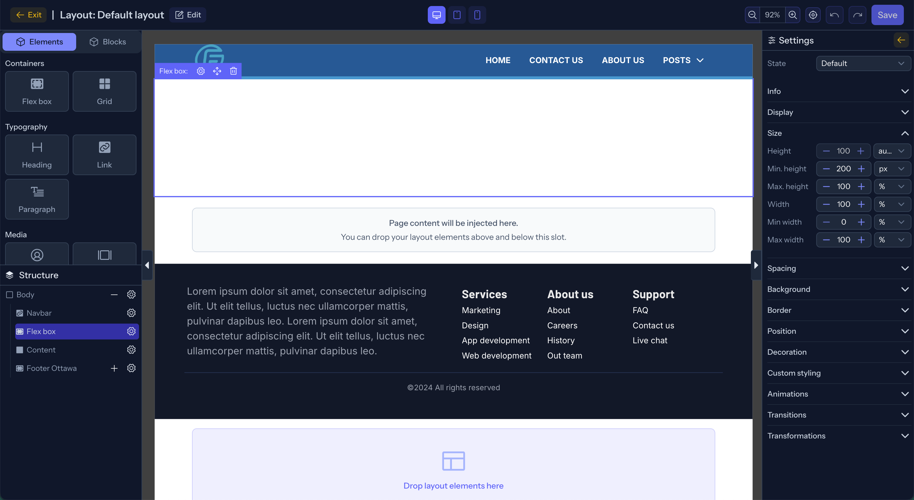

# VelnoxAICMS

<div align="center">


### Next-Generation Open-Source AI-Native Modular CMS & Visual Page Builder

[](LICENSE)
[](https://laravel.com)
[](https://vuejs.org)
[](https://inertiajs.com)
[](https://tailwindcss.com)
[](https://php.net)

[Explore Features](#-key-features) • [Quick Start](#-quick-start-guide) • [Documentation](documentation/1-get-started.md) • [Contributing](CONTRIBUTING.md)

</div>

---

## 📖 Overview

**VelnoxAICMS** is a powerful, enterprise-grade, open-source Content Management System and drag-and-drop page builder built on the **VILT** stack (**Vue 3**, **Inertia.js v2**, **Laravel 13**, and **Tailwind CSS v4**). 

Designed for high-performance applications, VelnoxAICMS combines **AI-assisted plugin & content generation**, an interactive **Visual Drag-and-Drop Page Builder**, **Headless CMS collections**, **visual workflow automation**, and real-time infrastructure powered by **Laravel Octane (FrankenPHP)**, **Laravel Reverb (WebSockets)**, and **Laravel Horizon**.



---

## 🏷️ GitHub Metadata & Tags

If you are hosting or starring this project on GitHub, here is the suggested repository configuration:

* **Short Description**: Next-Generation Open-Source AI-Native Modular CMS & Visual Drag-and-Drop Page Builder built on Vue 3, Inertia.js v2, Laravel 13, and Tailwind CSS v4.
* **Topics / Tags**:
  `laravel`, `laravel13`, `vue3`, `inertiajs`, `cms`, `page-builder`, `ai-cms`, `drag-and-drop`, `tailwind-css`, `frankenphp`, `laravel-octane`, `laravel-reverb`, `laravel-horizon`, `spatie-permissions`, `headless-cms`, `open-source`, `php85`, `typescript`, `modular-architecture`, `ai-generator`

---

## 📌 Quick Access Links

- 📖 [Getting Started Guide](documentation/1-get-started.md)
- 🎨 [Page Builder Guide](documentation/2-builder.md)
- 💻 [Developer Architecture Notes](documentation/3-developer.md)
- ⚙️ [Developer Setup & Workflow Guide](documentation/4-developer-guide.md)
- 🤝 [Contribution Guidelines](CONTRIBUTING.md)
- 📄 [MIT License](LICENSE)

---

## 🌟 Key Features

### 🧩 Visual Drag-and-Drop Page Builder
* **Pragmatic Drag & Drop Engine**: Smooth component dragging and nesting powered by `@atlaskit/pragmatic-drag-and-drop`.
* **Rich Text & Inline Typography**: Built-in TipTap editor for live inline formatting, custom styling, links, and text controls.
* **Live Layout & CSS Customization**: Real-time canvas editing with embedded CodeMirror custom CSS editor and section re-ordering.
* **Responsive Breakpoint Previews**: Desktop, tablet, and mobile device viewport previews out-of-the-box.

### 🤖 AI Engine & Modular Marketplace
* **AI Extension Architect**: Generate modular CMS plugins and themes on-the-fly using multi-provider AI (OpenAI, Gemini, Anthropic, DeepSeek).
* **AI Spec Export & Installer**: Inspect AI-generated extension specifications, download structured JSON specs, and upload/install ZIP extension packages.
* **AI Copywriting & SEO**: Integrated AI helpers for page copywriting, SEO metadata generation, and content creation.

### ⚡ High-Performance Real-Time Infrastructure
* **Laravel Octane Engine**: Powered by FrankenPHP long-running workers for ultra-low latency response times.
* **Laravel Horizon Integration**: Redis queue monitoring, background job tracking, and auto-scaling workers with automated metrics snapshots.
* **Laravel Reverb WebSockets**: Native, real-time WebSocket broadcasting with Laravel Echo integration.
* **Nuxt UI v3 Component Library**: Modern, accessible UI elements styled with Tailwind CSS v4 and full dark mode support.

### ⚙️ Automation & Workflow Engine
* **Visual Workflow Builder**: Interactive node-based automation workflow editor for event-driven logic.
* **Webhooks Integration**: Inbound and outbound webhooks for third-party integrations and API automation.

### 📦 Decoupled Modular Architecture (23 Modules)
Built with `nwidart/laravel-modules` into clean, maintainable domain modules:
* **Builder**: Drag-and-drop canvas, blueprints, and draggable UI components.
* **Marketplace**: AI plugin generator, spec viewer, and module installer.
* **Workflow & Automation**: Visual workflow engine & webhook integrations.
* **Page & Content**: Pages, blog posts, categories, and Headless CMS collections.
* **Media**: File manager & asset media library (Spatie MediaLibrary).
* **Layout & Menu**: Header/Footer layout builder and hierarchical menu builder.
* **Acl & Auth**: Spatie Laravel Permission (Roles & Permissions) and user authentication.
* **Localization**: Multi-language translation management (Spatie Translatable).
* **AuditLog & Visits**: Activity logging (Spatie Activitylog) and visitor analytics.
* **ApiTokens & Settings**: API token management for headless delivery and site configuration.

---

## 🛠️ Tech Stack & Requirements

### System Requirements
* **PHP**: 8.5+ (Extensions: `redis`, `pdo_mysql` / `pdo_pgsql` / `pdo_sqlite`, `mbstring`, `gd` / `imagick`)
* **Node.js**: 20.x+ & `npm`
* **Composer**: 2.6+
* **Redis**: Server running on `127.0.0.1:6379`
* **Database**: MySQL 8.0+, PostgreSQL 14+, or SQLite

### Technology Architecture

| Component | Framework / Library |
|---|---|
| **Backend Framework** | [Laravel 13](https://laravel.com) |
| **Frontend Stack** | [Vue 3.5](https://vuejs.org) + [Inertia.js v2](https://inertiajs.com) |
| **UI Components & Styling** | [Nuxt UI v3](https://ui.nuxt.com) + [Tailwind CSS v4](https://tailwindcss.com) |
| **High-Performance Server** | [Laravel Octane](https://laravel.com/docs/octane) (FrankenPHP) |
| **Queue Management** | [Laravel Horizon](https://laravel.com/docs/horizon) (Redis) |
| **WebSockets** | [Laravel Reverb](https://laravel.com/docs/reverb) + [Laravel Echo](https://laravel.com/docs/broadcasting) |
| **State & Utilities** | [Pinia](https://pinia.vuejs.org) + [VueUse](https://vueuse.org) |
| **Type Generator** | [Spatie TypeScript Transformer](https://github.com/spatie/laravel-typescript-transformer) |
| **Modular Core** | [nwidart/laravel-modules](https://nwidart-modules.com) |

---

## 🚀 Quick Start Guide

### 1. Clone & Install Dependencies

```bash
# Clone the open-source repository
git clone https://github.com/taha123618/VelnoxAICMS.git
cd VelnoxAICMS

# Install PHP dependencies
composer install

# Install Node dependencies
npm install
```

### 2. Configure Environment

```bash
# Copy example environment file
cp .env.example .env

# Generate application security key
php artisan key:generate
```

Configure your database and Redis settings in `.env`:

```env
APP_NAME=VelnoxAICMS
APP_URL=http://localhost:8000

DB_CONNECTION=mysql
DB_HOST=127.0.0.1
DB_PORT=3306
DB_DATABASE=velnoxaicms
DB_USERNAME=root
DB_PASSWORD=

QUEUE_CONNECTION=redis
CACHE_STORE=redis
REDIS_HOST=127.0.0.1
REDIS_PORT=6379

REVERB_APP_ID=632013
REVERB_APP_KEY=5oqftkhfzedrovhonw4h
REVERB_APP_SECRET=izzjr36m69l5stagq2dz
REVERB_HOST="localhost"
REVERB_PORT=8081
REVERB_SCHEME=http

OCTANE_SERVER=frankenphp
```

### 3. Run Database Migrations & Seeders

```bash
php artisan migrate --seed
```

### 4. Transform TypeScript Types

Generate frontend TypeScript interfaces from backend PHP Data Transfer Objects (DTOs):

```bash
php artisan typescript:transform
```

---

## 💻 Development Workflow

### Launch All-In-One Dev Server

VelnoxAICMS includes a concurrent development process that boots **Octane (FrankenPHP)**, **Horizon**, **Reverb WebSockets**, **Pail Log Tail**, and **Vite HMR**:

```bash
composer run dev
```

### Key Development Commands

| Command | Description |
|---|---|
| `composer run dev` | Boot Octane, Horizon, Reverb, Pail logs, and Vite concurrently |
| `npm run build` | Compile frontend assets for production |
| `php artisan typescript:transform` | Regenerate TypeScript interfaces from PHP DTOs |
| `composer analyse` | Run **PHPStan** static analysis & **Rector** refactoring |
| `vendor/bin/pint --dirty` | Format modified PHP files using Laravel Pint |
| `composer test` | Execute the **Pest v4** test suite |

---

## 🤝 Contributing

Contributions are welcome! Whether you are fixing bugs, improving documentation, or proposing new features, please read our [Contributing Guidelines](CONTRIBUTING.md) before submitting a pull request.

---

## 📄 License & Credits

- **Author**: [Taha Ahmed](mailto:tahaahmedanees2@gmail.com)
- **License**: Open-source under the [MIT License](LICENSE).
