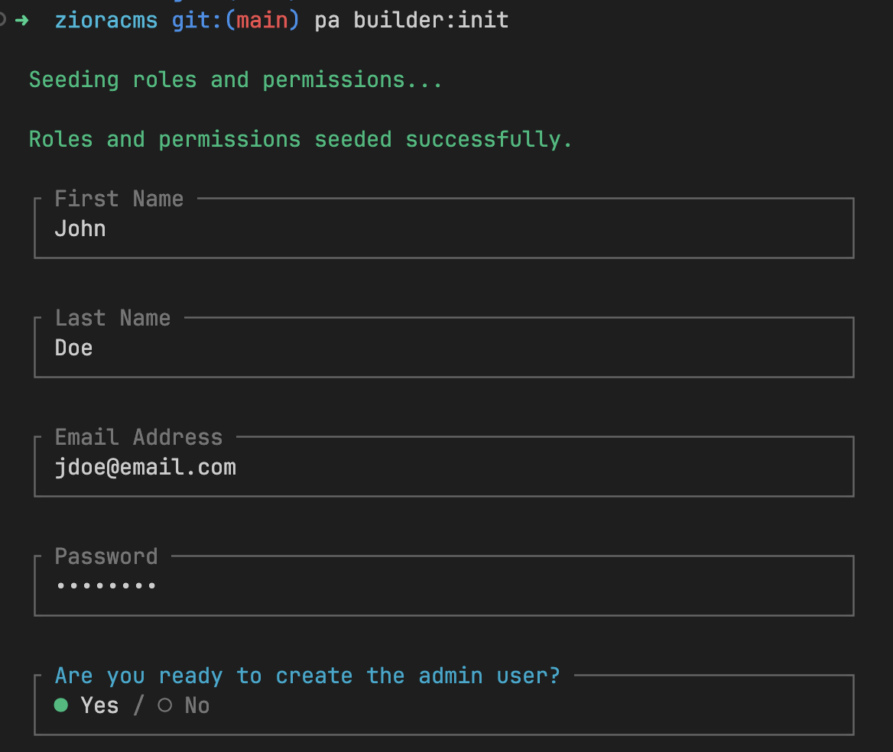

## Server requirements
As this is a Laravel-based application, your server must meet the minimum requirements for running a Laravel 12+ application. See a full list of requirements on the [Laravel website here](https://laravel.com/docs/12.x/deployment#server-requirements).

## Set up
> [!IMPORTANT] 
> ZioraCMS cannot be installed in > an existing application. It should be used to create a brand new application.

* Clone the repository
```bash:no-line-numbers 
git clone https://github.com/fusigabs/zioracms.git
```
* Set your database credentials in `.env`

```bash:no-line-numbers 
DB_HOST=127.0.0.1
DB_PORT=3306
DB_DATABASE=database_name
DB_USERNAME=forge
DB_PASSWORD=dasasasasa
```

* In the application folder, install the composer packages:
```bash:no-line-numbers 
composer update
```
* Install Node modules
```bash:no-line-numbers 
npm install
```
* Generate laravel application key
```bash:no-line-numbers 
php artisan key:generate
```
* Initialize Ziora CMS by creating roles, permissions and an admin user
```bash:no-line-numbers 
php artisan builder:init
```
This command will seed the database roles and permissions, and provide an interactive prompt to create an admin user.


* Link the storage folder. 
```bash:no-line-numbers 
php artisan storage:link
```
In this version of ZioraCMS, files are stored in a local disk, but as this is just a laravel application, you can configure other file storage as necessary. See [Laravel's official documentation](https://laravel.com/docs/12.x/filesystem#main-content) on how to configure file storage.

* Run the development server
```bash:no-line-numbers 
composer dev
```

* Go to your site URL and it should display a welcome page. Note that when the application is first created and before you choose a front page, this Welcome page is displayed as a fallback. But once a front page is set in the Admin panel, it will override the Welcome page as the home URL.

## Deployment
Again since this is a regular Inertia.js application, you can follow normal recommended Laravel deployment options. Generally this is the command to build the application in production:

* If you intend to run SSR, then build for SSR:
```bash:no-line-numbers 
npm run build:ssr
```
You can read more about [Inertiajs SSR here](https://inertiajs.com/server-side-rendering)

* If you do not need SSR, build the client-side bundle:
```bash:no-line-numbers 
npm run build
```

If deploying in [Laravel forge](https://forge.laravel.com), this is an example deploy script (for SSR):

```bash{13-14}
cd /home/forge/mywebsite.com
git pull origin $FORGE_SITE_BRANCH

$FORGE_COMPOSER install --no-dev --no-interaction --prefer-dist --optimize-autoloader

( flock -w 10 9 || exit 1
    echo 'Reloading PHP FPM...'; sudo -S service $FORGE_PHP_FPM reload ) 9>/tmp/fpmlock

if [ -f artisan ]; then
    $FORGE_PHP artisan migrate --force
fi

npm ci 
npm run build:ssr
```
