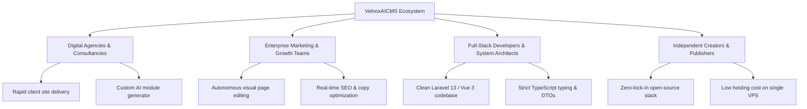

# Business Requirement Document (BRD)
## Project: VelnoxAICMS
**Document Version:** 1.0.0  
**Status:** Approved  
**Author:** Product & Engineering Leadership  
**Target Platform:** Enterprise & Open-Source AI-Native Modular CMS  

---

## 1. Executive Summary

### 1.1 Project Overview
**VelnoxAICMS** is an open-source, enterprise-ready, AI-native Content Management System (CMS) and visual drag-and-drop page builder. Built upon modern web engineering standards—the **VILT** stack (**Vue 3.5**, **Inertia.js v2**, **Laravel 13**, and **Tailwind CSS v4**) powered by **Laravel Octane (FrankenPHP)**, **Laravel Horizon (Redis queues)**, and **Laravel Reverb (real-time WebSockets)**—VelnoxAICMS bridges the gap between traditional monolithic CMS platforms (e.g., WordPress/Drupal) and modern headless, API-first platforms (e.g., Strapi/Sanity) while integrating native multi-provider Generative AI capabilities.

### 1.2 Problem Statement
Modern digital content teams, digital agencies, and enterprise software engineering teams face severe operational friction:
1. **Developer-Marketer Friction:** Developers are constantly burdened with routine UI tweaks, while non-technical editors are blocked by rigid templates.
2. **AI Fragmented Workflows:** AI tools (copywriting, image generation, layout generation) currently exist as disconnected third-party SaaS apps outside the CMS workflow.
3. **Monolithic Bloat vs. Headless Overhead:** Monolithic legacy CMS systems suffer from slow runtime performance, security vulnerabilities, and outdated architectures. Conversely, pure headless systems require extensive custom frontend engineering for basic page layouts.
4. **Extensibility Bottlenecks:** Plugin creation in traditional CMS platforms is error-prone, lacks type safety, and cannot leverage automated AI-assisted code synthesis.

### 1.3 Solution Vision
VelnoxAICMS delivers an all-in-one ecosystem:
- **Visual Drag-and-Drop Layout Canvas:** Fluid, responsive visual builder powered by `@atlaskit/pragmatic-drag-and-drop` and TipTap.
- **Embedded AI Architect:** Multi-model agentic AI capable of generating layouts, rich copy, SEO metadata, and full modular extension specs.
- **High-Throughput Runtime:** Sub-10ms response times delivered via FrankenPHP worker threads and Redis caching.
- **Modular Monolith & Headless Hybrid:** 23 modular domains (`nwidart/laravel-modules`) with first-class REST/Sanctum APIs for headless multi-channel publishing.

---

## 2. Business Objectives & Strategic Goals

| ID | Strategic Goal | Key Metric / KPI | Target (12 Months) |
|---|---|---|---|
| **BG-01** | Accelerate Page Creation Velocity | Time to create & publish responsive landing page | **< 15 minutes** (75% reduction vs traditional CMS) |
| **BG-02** | Lower Infrastructure Total Cost of Ownership (TCO) | Server requests handled per second (RPS) per CPU core | **> 1,800 RPS** under Octane/FrankenPHP |
| **BG-03** | Increase Developer Extensibility | Time to generate, validate, and install a custom plugin module | **< 3 minutes** using AI Extension Architect |
| **BG-04** | Open-Source Community & Ecosystem Growth | GitHub stars, community active contributors, marketplace packages | **5,000+ stars**, **100+ public marketplace modules** |
| **BG-05** | Enterprise Multi-Tenant & Governance Adoption | Enterprise security compliance, RBAC audit trails, SOC2 readiness | **100% auditable actions** via Spatie Activitylog |

---

## 3. Stakeholder Profiles & Target Audience

### 3.1 Stakeholder Matrix

| Stakeholder Persona | Core Pain Points | Expected Business Value |
|---|---|---|
| **Agency Technical Director** | High maintenance cost of legacy WordPress/Drupal installations; high churn due to sluggish client sites. | Rapid site building, modular client customization, automated AI spec generation, zero security patching overhead. |
| **Enterprise Marketing Lead** | Dependency on engineering sprints to launch marketing campaigns, landing pages, and localization. | No-code visual drag-and-drop page builder, inline AI copywriter, instant draft/publish preview with responsive breakpoints. |
| **Senior Laravel/Vue Developer** | Spaghetti code in legacy CMS plugins; lack of typing and modern CI/CD integration. | Strict architectural conventions (Action classes, DTOs, TypeScript transformers, Pest v4 test suites, Pint formatting). |
| **Content Operations & SEO Specialist** | Manual meta tagging, fragmented translation workflows, unoptimized media assets. | Automated SEO audits, Spatie Translatable multi-locale support, chunked WebP media pipeline. |

---

## 4. Market Analysis & Competitive Differentiation

| Capability / Dimension | **VelnoxAICMS** | **WordPress + Elementor** | **Webflow** | **Strapi / Sanity (Headless)** |
|---|---|---|---|---|
| **Core Architecture** | Laravel 13 + Vue 3.5 + Octane | PHP 7/8 + jQuery / React legacy | Proprietary SaaS | Node.js / Go REST & GraphQL |
| **Visual Page Builder** | Native Pragmatic DnD + AST Canvas | Heavy DOM Bloat, shortcodes | Visual CSS Designer (Proprietary) | None (Requires custom Next/Nuxt app) |
| **AI Native Integration** | Built-in Agents (Layout, Copy, SEO, Specs) | Fragmented 3rd-party plugins | Basic AI writing helper | External API integration needed |
| **Plugin Extensibility** | AI Spec Generator + Laravel Modules | PHP hook plugins (untyped) | Limited Apps (SaaS walled garden) | Custom Node plugins / webhooks |
| **Real-time Performance** | FrankenPHP workers + Reverb WebSockets | Standard PHP-FPM (slow) | CDN-hosted static assets | Fast Node/Edge APIs |
| **Hosting & Ownership** | 100% Self-Hosted Open-Source (MIT) | Self-Hosted / Managed WP | Proprietary Vendor Lock-in | Self-hosted or Cloud SaaS |
| **Type Safety** | End-to-end (PHP DTOs to TypeScript) | None | Closed schema | TypeScript schemas |

---

## 5. Scope of the System

### 5.1 In-Scope Business Capabilities
- **Visual Drag-and-Drop Builder:** Canvas editing, element tree hierarchy, responsive design preview (Desktop, Tablet, Mobile), custom CSS injection via CodeMirror, live preview.
- **AI Engine & Copilot:**
  - AI Page Section Generator (converting natural language prompts to AST JSON layout trees).
  - AI Copywriting & Text Refining (in-context TipTap AI transforms).
  - AI SEO Optimizer (title, meta description, OpenGraph tags, keyword scoring).
  - AI Marketplace Architect (generating structured JSON specs and deployable extension archives).
- **23 Domain Modules:** Content, Page, Category, Layout, Menu, Media, Forms, Testimonial, Contacts, Workflow, Automation, Visits, AuditLog, Acl, Auth, ApiTokens, Settings, etc.
- **Enterprise Security & Governance:** Role-Based Access Control (RBAC via Spatie Permission), full activity audit logs (Spatie Activitylog), API token authentication (Laravel Sanctum).
- **Workflow & Automation Engine:** Visual node-based workflow builder with inbound/outbound webhook integration.

### 5.2 Out-of-Scope (Future Releases)
- Native mobile app builders (Flutter/React Native export).
- Distributed multi-region edge database sync (handled via external DB clusters in v1.0).
- SaaS multi-tenant billing/subscription engine (available as an add-on marketplace module).

---

## 6. Business Risks & Mitigation Strategy

| Risk Category | Identified Risk | Impact | Probability | Mitigation Strategy |
|---|---|---|---|---|
| **AI LLM Cost & Rate Limits** | High volume of prompt generations causing vendor rate limits or excessive API expenses. | High | Medium | Implement semantic response caching in Redis, prompt token budgeting, client-side rate limiting, and multi-provider fallback (OpenAI, Gemini, Anthropic, DeepSeek). |
| **Malicious Plugin Uploads** | User uploads ZIP extensions with malicious code execution. | Critical | Low | Strict package validation, AST schema verification, sandboxed manifest parsing, and Spatie permission guards before module activation. |
| **Prompt Injection & Data Leakage** | Malicious prompt inputs attempting to extract system instructions or leaking PII. | High | Medium | Integrated `PromptInjectionGuard` and `PIIRedactor` interceptors on all AI Agent pipelines. |
| **Performance Degradation on Large Layouts** | Page builder AST JSON becoming excessively deeply nested. | Medium | Low | Depth validation in `PageSectionGenerator` and virtualized canvas node rendering. |

---

## 7. Monetization, Licensing & Governance

1. **Core Distribution:** 100% Free and Open-Source under the **MIT License**.
2. **Ecosystem Monetization (Marketplace):**
   - Verified developer plugin marketplace with revenue share model (70/30).
   - Premium AI Agent templates, pre-built enterprise theme packs, and domain-specific workflow automation nodes.
3. **Enterprise Support & Cloud Hosting:** Commercial support SLAs, custom enterprise AI connectors, and one-click managed cloud deployments via Laravel Cloud / AWS.
