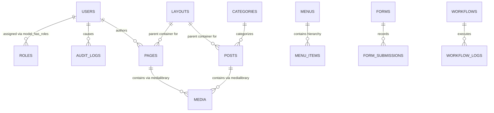

# Data Strategy Document
## Project: VelnoxAICMS
**Document Version:** 1.0.0  
**Status:** Approved  
**Lead Data Architect:** Data & Platform Architecture Team  
**Scope:** Data Architecture, Data Governance, Streaming, Privacy & Disaster Recovery  

---

## 1. Data Architecture & Master Data Model

VelnoxAICMS leverages a hybrid data model:
1. **Relational Structured Entities:** Relational SQL tables for transactional records (users, roles, permissions, pages, layouts, categories, media, audit logs, form entries).
2. **Document / Abstract Syntax Tree (AST) Store:** Validated JSON column structures storing page builder component hierarchies.
3. **In-Memory Telemetry & State:** High-speed Redis storage for active user sessions, Octane concurrency tables, Horizon queue backlogs, and WebSocket presence.



### 1.1 Core Relational Schema Specifications

| Table Name | Primary Keys & Indexes | Key Columns & Data Types | Storage Engine |
|---|---|---|---|
| `pages` | `id` (ULID/BigInt PK), `slug` (Unique Index), `status` (Index) | `title` (VARCHAR), `slug` (VARCHAR), `layout_id` (FK), `content` (JSON AST), `status` (ENUM: draft, published, archived), `deleted_at` (TIMESTAMP) | InnoDB / Postgres |
| `layouts` | `id` (PK), `name` (VARCHAR Index) | `name` (VARCHAR), `content` (JSON AST), `is_default` (BOOLEAN) | InnoDB / Postgres |
| `media` | `id` (PK), `model_type` + `model_id` (Composite Index) | `collection_name` (VARCHAR), `file_name` (VARCHAR), `mime_type` (VARCHAR), `size` (BIGINT), `custom_properties` (JSON), `responsive_images` (JSON) | InnoDB / Postgres |
| `activity_log` | `id` (PK), `subject_type` + `subject_id` (Index), `causer_id` (Index) | `log_name` (VARCHAR), `description` (TEXT), `properties` (JSON: attributes & old diffs), `created_at` (TIMESTAMP Index) | InnoDB / Postgres |
| `visits` | `id` (PK), `created_at` (Index), `path` (Index) | `ip_hash` (CHAR 64), `path` (VARCHAR), `referrer` (VARCHAR), `user_agent` (VARCHAR), `device` (VARCHAR), `country` (CHAR 2) | InnoDB / Postgres |
| `forms` & `form_submissions` | `id` (PK), `form_id` (FK Index) | `form_id` (FK), `payload` (JSON), `status` (VARCHAR: new, read, resolved) | InnoDB / Postgres |

---

## 2. AST Data Serialization & Validation

Page builder layouts are stored in the `content` JSON column. The JSON payload is validated using Spatie Laravel Data Transfer Objects:

```
{
  "version": "1.0",
  "root": {
    "type": "wrapper",
    "name": "Landing Page Root",
    "props": { "backgroundColor": "#0b0f19", "padding": "0px" },
    "children": [
      {
        "type": "grid",
        "name": "Hero 2-Col Grid",
        "props": { "gridTemplateColumns": "1fr 1fr", "gap": "24px" },
        "children": [ ... ]
      }
    ]
  }
}
```

- **Validation:** Validated against the `TElement` schema before persistence to prevent malformed or unrenderable canvas trees.
- **Atomic Commits:** Page updates are wrapped inside database transactions (`DB::transaction()`) to guarantee atomicity.

---

## 3. Data Tiering & Storage Lifecycle

```mermaid
graph LR
    subgraph Hot Tier (In-Memory / Sub-ms)
        T_Hot[Redis 7 + Octane Shared Memory]
        T_Hot_Desc[User sessions, rate limits, Reverb presence, queue jobs]
    end

    subgraph Warm Tier (Primary Relational / < 5ms)
        T_Warm[MySQL 8.0+ / PostgreSQL 14+]
        T_Warm_Desc[Pages, layouts, users, permissions, active revisions]
    end

    subgraph Cold Tier (Object Storage & Archival)
        T_Cold[AWS S3 / Cloudflare R2 / Glacier]
        T_Cold_Desc[Media originals, WebP conversions, DB backups, audit logs > 90 days]
    end

    T_Hot -->|Async Sync / Persistence| T_Warm
    T_Warm -->|Nightly Automated Archival| T_Cold
```

### 3.1 Data Retention Policies

| Data Category | Warm Storage Retention | Archival & Purge Policy | Automation Command |
|---|---|---|---|
| **Activity Audit Logs** | 90 Days in Primary DB | Compressed and archived to cold S3 storage; purged from DB after 90 days. | `php artisan activitylog:clean` |
| **Visitor Analytics Hits** | 180 Days in Primary DB | Aggregated to monthly summary stats; raw IP hashes purged after 180 days. | `php artisan visits:aggregate-and-purge` |
| **Page Draft Revisions** | Last 10 revisions retained per page | Older unpinned draft revisions pruned automatically upon page publish. | `php artisan pages:prune-revisions` |
| **Temp Chunk Uploads** | 24 Hours in `/storage/tmp` | Abandoned or incomplete multipart upload chunks purged daily. | `php artisan media:clean-chunks` |

---

## 4. Vector Strategy & Semantic Search for CMS

To support AI contextual search across large CMS installations:
1. **Embedding Generation:** CMS pages, posts, and media metadata are processed through OpenAI `text-embedding-3-small` or Gemini Embeddings upon publication.
2. **Vector Indexing:** Stored in a lightweight vector table (PostgreSQL `pgvector` or SQLite `sqlite-vec`).
3. **Retrieval Use Cases:**
   - AI Agent contextual referencing (e.g. *"Generate a section matching the tone of our latest 3 blog posts"*).
   - Smart internal link auto-suggestions in the TipTap editor.
   - Semantic media asset search (e.g. searching *"hero banner with laptop in dark office"* retrieves matching images via AI visual tags).

---

## 5. Compliance, Privacy & Data Governance (GDPR / CCPA)

1. **Zero Raw PII Storage for Analytics:** The `visits` module generates a salted SHA-256 hash of `ip_address + user_agent + daily_salt`, guaranteeing anonymous visitor tracking without storing identifiable IP addresses.
2. **Right to Be Forgotten (GDPR Art. 17):** Dedicated action `AnonymizeUserDataAction` scrubs user PII, anonymizes activity log causer details, and reassigns created pages to a system placeholder account.
3. **Data Export (GDPR Art. 20):** One-click ZIP/JSON export of all user data, authored posts, and media uploads.
4. **Encryption at Rest & in Transit:** All database connections and S3 communications enforce TLS 1.3 encryption. Sensitive API keys and credentials in `settings` are encrypted using Laravel's AES-256-GCM application key.

---

## 6. Disaster Recovery & Business Continuity

- **Recovery Point Objective (RPO):** **< 15 minutes** (achieved via continuous binary database log shipping).
- **Recovery Time Objective (RTO):** **< 30 minutes** (automated restore via containerized Docker orchestration).
- **Backup Regimen:**
  - Automated daily full SQL snapshot to encrypted S3 bucket.
  - Hourly differential backups.
  - Multi-region asset replication for Spatie MediaLibrary buckets.
