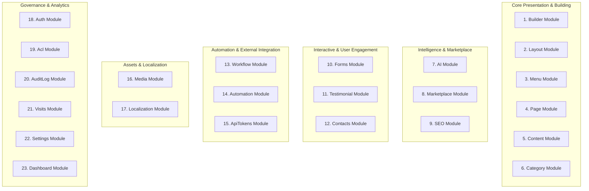
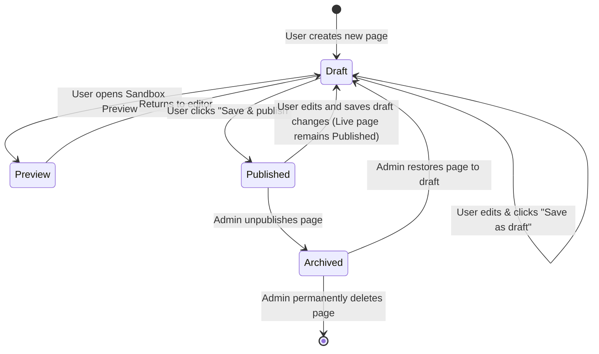

# Functional Requirement Document (FRD)
## Project: VelnoxAICMS
**Document Version:** 1.0.0  
**Status:** Approved  
**Functional Systems Lead:** Product Architecture  
**Scope:** Functional Specifications across all 23 Domain Modules  

---

## 1. Domain Functional Decomposition

VelnoxAICMS is organized into **23 decoupled functional modules** that interact through well-defined PHP Action contracts, Spatie Data DTOs, and event broadcasts.

---

## 2. Comprehensive Module Functional Requirements

### 2.1 Builder Module (`Modules/Builder`)
- **FR-BLD-01 (Canvas Drag & Drop):** The system shall allow users to drag elements from the Left Sidebar Element Drawer onto the visual canvas. Nested drops inside container elements (`wrapper`, `grid`, `flexbox`) must be supported up to a depth of 10 levels.
- **FR-BLD-02 (AST Tree Outliner):** The system shall render a real-time DOM outliner tree. Users can drag nodes within the tree to reorder, re-parent, or delete elements with instantaneous canvas synchronization.
- **FR-BLD-03 (Element Settings Inspector):** When an element is selected on canvas, the Right Sidebar must render dynamic property controls (typography, flat camelCase CSS styles, flex/grid alignment, background colors, borders, and margins).
- **FR-BLD-04 (Responsive Device Switching):** The system shall provide Desktop, Tablet (768px), and Mobile (375px) preview switches. Style modifications made while in Tablet or Mobile mode shall apply responsively without overriding desktop base styles.
- **FR-BLD-05 (Custom CSS Injection):** The system shall embed a CodeMirror editor enabling users to write custom CSS rules scoped to the selected element or page level.

### 2.2 AI Module (`Modules/Ai`)
- **FR-AI-01 (Page Section Generation):** The system shall execute `PageSectionGenerator` to transform natural language prompts into validated `TElement` AST JSON sections.
- **FR-AI-02 (Inline Content Synthesis):** The system shall execute `ContentGenerator` to rewrite, expand, summarize, translate, or format highlighted text blocks within the TipTap editor.
- **FR-AI-03 (Automated SEO Tagging):** The system shall execute `SeoOptimizer` to generate keyword-optimized meta titles (≤60 chars), meta descriptions (≤155 chars), OpenGraph titles, and readability assessments.
- **FR-AI-04 (Prompt Safety Guardrails):** All AI agent requests must pass through `PromptInjectionGuard` (blocking injection attacks) and `PIIRedactor` (redacting credit cards, API tokens, and secrets).

### 2.3 Marketplace Module (`Modules/Marketplace`)
- **FR-MKT-01 (AI Extension Generator):** The system shall execute `MarketplaceGenerator` to generate complete modular plugin specifications in structured JSON format.
- **FR-MKT-02 (Spec Inspection & Export):** The system shall provide an interactive JSON spec viewer and download mechanism for generated extension manifests.
- **FR-MKT-03 (ZIP Package Installer):** The system shall validate uploaded ZIP extension packages (checking file manifests, permissions, and database migrations) and extract them into the `Modules/` directory with automatic module registration.

### 2.4 Page & Content Modules (`Modules/Page`, `Modules/Content`, `Modules/Category`)
- **FR-PAG-01 (Page CRUD & Association):** Users shall create, update, delete, and duplicate pages. Every page must be linked to a parent `Layout`.
- **FR-PAG-02 (Draft / Publish Workflow):** Pages support `draft`, `published`, and `archived` states. Changes saved as draft must not be visible to public visitors until explicitly published.
- **FR-CNT-01 (Headless Collections):** Users can define structured blog posts and custom content collections categorized under hierarchical terms managed by `Category`.

### 2.5 Media Module (`Modules/Media`)
- **FR-MED-01 (Chunked File Upload):** The system shall slice uploaded files into 1MB chunks on the client and reassemble them on the server, avoiding HTTP request timeout limitations.
- **FR-MED-02 (Spatie MediaLibrary Processing):** The system shall automatically generate thumbnail conversions, WebP optimized variations, and store metadata (dimensions, MIME type, file size).
- **FR-MED-03 (Builder Media Picker):** When an image/video element or background setting is clicked in the builder, an overlay modal shall open the Media Library for single or multi-asset selection.

### 2.6 Layout & Menu Modules (`Modules/Layout`, `Modules/Menu`)
- **FR-LAY-01 (Global Layout Canvas):** The system shall allow visual creation and editing of global site headers, footers, and persistent drawer layouts using the builder canvas.
- **FR-MNU-01 (Hierarchical Menu Builder):** The system shall provide a drag-and-drop tree interface to construct multi-level navigation menus linking to internal pages, category feeds, or custom URLs.

### 2.7 Forms, Testimonial & Contacts Modules (`Modules/Forms`, `Modules/Testimonial`, `Modules/Contacts`)
- **FR-FRM-01 (Visual Form Construction):** Users can drop form elements (inputs, textareas, checkboxes, dropdowns, submit buttons) into builder pages.
- **FR-FRM-02 (Submission Handling):** Form submissions shall be validated on the backend, logged in the database, and trigger automated notifications or workflows.
- **FR-TST-01 (Dynamic Testimonial Carousel):** The builder shall include dynamic testimonial blocks that fetch and render approved customer reviews at runtime.
- **FR-CNT-02 (Contact Directory):** Centralized CRM table capturing contact form entries with status management (`new`, `contacted`, `resolved`).

### 2.8 Workflow & Automation Modules (`Modules/Workflow`, `Modules/Automation`)
- **FR-WKF-01 (Visual Node Graph):** The system shall provide an interactive canvas to construct event-action automation graphs (Triggers -> Conditions -> Actions).
- **FR-AUT-01 (Webhook Management):** Inbound webhooks with HMAC signature verification and outbound webhook dispatchers with exponential backoff retries.

### 2.9 Access Control & Security Modules (`Modules/Acl`, `Modules/Auth`, `Modules/AuditLog`, `Modules/ApiTokens`)
- **FR-ACL-01 (Role & Permission Matrix):** Super Admin can create custom roles and assign granular permissions powered by Spatie Permissions.
- **FR-AUD-01 (Audit Trail):** Every administrative mutation (page edit, role assignment, file deletion, setting modification) is logged in Spatie Activitylog with old vs new attribute diffs.
- **FR-TOK-01 (Sanctum API Token Management):** Users can generate scoped personal access tokens with custom expiry dates for headless API integrations.

### 2.10 Localization, Visits, Settings & Dashboard
- **FR-LOC-01 (Multi-Locale Translation):** Manage translation dictionaries and localize page fields via Spatie Translatable.
- **FR-VIS-01 (Visitor Analytics):** Capture anonymous page hits, referrer URLs, device types, and browser metrics with zero third-party cookie dependencies.
- **FR-SET-01 (Global Site Settings):** Manage site branding, logo, favicon, SMTP mail credentials, default AI provider keys, and maintenance mode toggles.
- **FR-DSH-01 (Executive Dashboard):** Aggregated metrics overview displaying total visits, published pages, active workflow runs, and AI token consumption.

---

## 3. Page Lifecycle & State Transition Model

---

## 4. Functional Error Handling & Edge Cases

| Module | Edge Case / Error Condition | System Behavior & User Recovery |
|---|---|---|
| **Builder** | Corrupted or unparseable AST JSON encountered. | System displays a localized error notification in canvas, loads fallback empty wrapper, and creates an audit incident. |
| **AI** | Model API rate limit or network timeout. | System retries with secondary fallback model provider; if all fail, returns user-friendly toast message: *"AI provider busy, please retry in a moment."* |
| **Marketplace** | Uploaded ZIP missing `module.json` manifest. | System rejects archive immediately, rolls back extraction, and displays error: *"Invalid module structure: module.json not found."* |
| **Media** | Network disconnection during 1MB chunk upload. | Frontend pauses upload queue, verifies uploaded chunk checksums upon reconnect, and resumes from the last failed chunk. |
