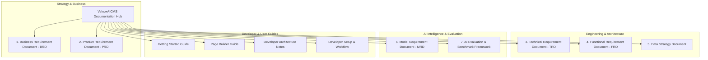

# VelnoxAICMS Architecture & Documentation Hub
## Master Specification & Requirements Index

Welcome to the **VelnoxAICMS Master Documentation Suite**. This hub provides end-to-end navigational access to all architectural, business, technical, functional, AI model, data governance, and evaluation specifications for the platform.

---

## 🗺️ Master Documentation Map

---

## 📑 Complete Document Directory

### 1. Business & Product Specifications
- 📊 **[Business Requirement Document (BRD)](./brd.md)**
  - Strategic Vision, ROI Models & KPIs (75% faster landing page launch velocity).
  - Stakeholder Profiles & Personas (Agency Directors, Enterprise Marketers, Full-Stack Engineers).
  - Competitive Matrix vs WordPress, Webflow, and Strapi.
  - Monetization & Marketplace 70/30 Revenue Share Strategy.

- 📝 **[Product Requirement Document (PRD)](./prd.md)**
  - Product Vision & Value Proposition.
  - Interactive User Journeys & Workflow Diagrams.
  - Detailed Breakdown across all 23 Modular Domains.
  - User Experience, Nuxt UI v3 Design System & WCAG 2.1 AA Accessibility Standards.
  - Release Milestones: v1.0 (Core VILT + Octane), v1.1 (Multi-Agent Copilot), v1.2 (Headless Edge), v2.0 (Autonomous Web CMS).

---

### 2. Technical & Functional Specifications
- 🛠️ **[Technical Requirement Document (TRD)](./trd.md)**
  - System Topology: Laravel 13, Octane (FrankenPHP), Horizon (Redis), Reverb WebSockets.
  - End-to-End Type Safety: Spatie Laravel Data DTOs + Spatie TypeScript Transformer.
  - Modular Engine (`nwidart/laravel-modules`) & Domain Action Pattern.
  - Visual Builder AST Engine (`TElement` JSON schema & Pragmatic DnD).
  - Real-Time WebSocket Channel Mapping & Background Horizon AI Queueing.
  - Security, Spatie RBAC Permissions & Activitylog polymorphic audit trails.

- 🧩 **[Functional Requirement Document (FRD)](./frd.md)**
  - Exhaustive Functional Requirements across all 23 Modules:
    - `Builder`, `Ai`, `Marketplace`, `Page`, `Content`, `Category`, `Layout`, `Menu`
    - `Forms`, `Testimonial`, `Contacts`, `Workflow`, `Automation`, `Media`, `Seo`
    - `Acl`, `Auth`, `ApiTokens`, `Settings`, `Visits`, `AuditLog`, `Localization`, `Dashboard`
  - Lifecycle & State Transition Diagrams (`Draft` -> `Preview` -> `Published` -> `Archived`).
  - Error Handling & Edge Case Recovery Protocols.

---

### 3. AI, Data & Evaluation Specifications
- 🤖 **[Model Requirement Document (MRD)](./mrd.md)**
  - Multi-Provider LLM Abstraction: Google Gemini 2.0/3.0 Flash, OpenAI GPT-4o-mini, Anthropic Claude 3.5 Sonnet, DeepSeek-V3/R1.
  - Agent-to-Model Mapping Matrix for `PageSectionGenerator`, `ContentGenerator`, `SeoOptimizer`, and `MarketplaceGenerator`.
  - Structured Output Contracts (`JsonSchema`) & Hyperparameter Calibration.
  - Interceptor Pipeline: `PromptInjectionGuard` and `PIIRedactor`.
  - Semantic Redis Caching, Circuit Breaking & Token Cost Controls.

- 🗄️ **[Data Strategy Document](./data-strategy.md)**
  - Relational Entity-Relationship Models + JSON AST Column Serialization.
  - 3-Tier Storage Lifecycle: Hot Tier (Redis 7), Warm Tier (MySQL/Postgres), Cold Tier (S3 / Cloudflare R2).
  - Automated Data Retention Policies (`activitylog:clean`, `visits:aggregate-and-purge`).
  - GDPR/CCPA Compliance: Anonymized analytics hashing, right-to-be-forgotten action.
  - Vector Strategy for CMS Knowledge & Semantic Search.
  - Disaster Recovery: RPO < 15 min, RTO < 30 min.

- 📈 **[AI Evaluation & Benchmark Framework](./ai-evaluation-framework.md)**
  - 3-Tier Evaluation Philosophy: Deterministic Schema Validation -> LLM-as-a-Judge -> Safety Audit.
  - 100-Prompt Golden Benchmark Suites for Section Layouts & Plugin Specs.
  - Quantitative Metrics: Schema adherence (100%), Aesthetic score (≥8.5/10), P95 Latency (<2.5s), Jailbreak defense (100%).
  - Automated CI/CD Testing Pipeline with Pest v4 harness.
  - Production Telemetry, User Acceptance Rates & Continuous Prompt Tuning.

---

### 4. Developer & Operational Guides
- 📖 **[1. Getting Started Guide](./1-get-started.md)**: Environment setup, `.env` configuration, migrations & seeders.
- 🎨 **[2. Page Builder Guide](./2-builder.md)**: Using the canvas, element tree, draft/publish lifecycle, and file manager.
- 💻 **[3. Developer Architecture Notes](./3-developer.md)**: Building modules, DTO generators, action patterns, and custom draggable components.
- ⚙️ **[4. Developer Setup & Workflow Guide](./4-developer-guide.md)**: Concurrent development environment (`composer run dev`), Pint formatting, and Pest testing.
