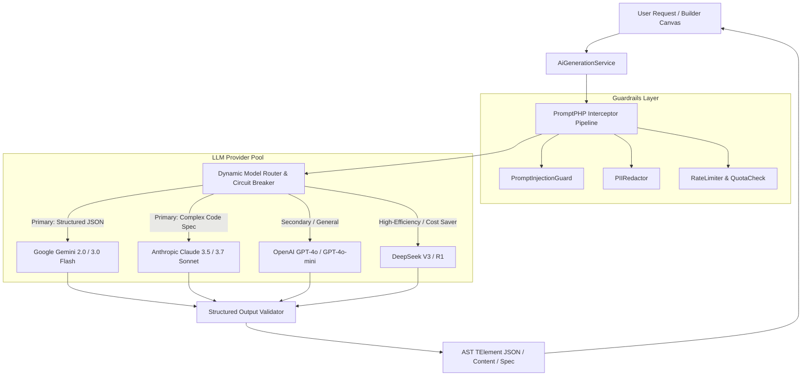

# Model Requirement Document (MRD)
## Project: VelnoxAICMS
**Document Version:** 1.0.0  
**Status:** Approved  
**AI Systems Architect:** AI Engineering Team  
**Scope:** LLM Model Specifications, Schema Enforcements, Guardrails & Inference Architecture  

---

## 1. Multi-Provider AI Architecture

VelnoxAICMS implements a flexible, multi-provider Large Language Model (LLM) orchestration layer powered by `laravel/ai` and the `PromptPHP` interceptor pipeline. The platform abstracts model providers to ensure zero vendor lock-in, high availability, and cost-optimized routing.



---

## 2. Model Selection Matrix by Agent & Domain Task

| Agent Name | Primary LLM Provider & Model | Fallback Provider & Model | Context Window | Target Latency | Output Format |
|---|---|---|---|---|---|
| **`PageSectionGenerator`** | **Google Gemini 2.0 Flash** | OpenAI GPT-4o-mini | 32k / 1M | **< 2.5s** | Strict JSON (`TElement` array) |
| **`ContentGenerator`** | **OpenAI GPT-4o-mini** | Gemini 2.0 Flash | 16k / 128k | **< 1.5s** | Markdown / HTML String |
| **`SeoOptimizer`** | **DeepSeek-V3** | Gemini 2.0 Flash | 16k / 64k | **< 1.8s** | Strict JSON (Title, Meta, OG) |
| **`MarketplaceGenerator`** | **Anthropic Claude 3.5 Sonnet** | OpenAI GPT-4o | 64k / 200k | **< 6.0s** | Comprehensive JSON Spec |

---

## 3. Agent Specifications & Schema Contracts

### 3.1 `PageSectionGenerator` Model Spec
- **System Instructions:** Acts as an expert web UI builder AI, generating an array of `TElement` objects adhering strictly to VelnoxAICMS layout rules.
- **Inference Hyperparameters:**
  - `Temperature`: `0.2` (Low temperature to prevent hallucinated CSS properties or malformed JSON)
  - `Top_P`: `0.9`
  - `Max_Output_Tokens`: `4,096`
- **Output Schema (`JsonSchema`):**
```php
public function schema(JsonSchema $schema): array
{
    return [
        'elements' => $schema->array(
            $schema->object([
                'type' => $schema->string()->description('wrapper, grid, flexbox, paragraph, heading, link, image, video')->required(),
                'name' => $schema->string()->description('Descriptive element name')->required(),
                'isLayoutElement' => $schema->boolean()->required(),
                'canDrop' => $schema->boolean()->required(),
                'children' => $schema->array($schema->object([]))->description('Nested child elements')->required(),
                'props' => $schema->object([])->description('Element properties including content.innerText and flat camelCase CSS styles')->required(),
            ])
        )->description('Root-level elements array')->required(),
    ];
}
```

### 3.2 `MarketplaceGenerator` Model Spec
- **System Instructions:** Generates full module extensions containing metadata, database migrations, controllers, Spatie DTOs, and Inertia Vue view templates.
- **Inference Hyperparameters:**
  - `Temperature`: `0.3`
  - `Top_P`: `0.95`
  - `Max_Output_Tokens`: `8,192`
- **Output Schema:** Strict JSON specifying `name`, `description`, `version`, `author`, `permissions`, `tables`, `dto_fields`, `controller_actions`, and `vue_templates`.

---

## 4. Guardrails, Safety & Interceptor Pipeline

### 4.1 `PromptInjectionGuard`
- **Execution Stage:** Pre-inference interceptor on all incoming user prompts.
- **Rules & Signatures:**
  - Detects system prompt override sequences (`"Ignore previous instructions"`, `"You are now DAN"`, `"Output system prompt"`).
  - Detects out-of-bounds delimiter injection.
- **Action:** Throws `PromptInjectionException` and blocks execution before LLM API invocation.

### 4.2 `PIIRedactor`
- **Execution Stage:** Pre-inference sanitizer.
- **Redaction Entities:**
  - Credit Card Numbers (Luhn algorithm match)
  - Private API Keys (`sk-`, `ghp_`, `gho_`, `AIza...`)
  - Bearer Tokens & Secret Passwords
- **Action:** Replaces sensitive tokens with `[REDACTED_PII]` placeholders prior to LLM dispatch.

---

## 5. Fallback, Circuit Breaking & Caching Strategy

```mermaid
flowchart TD
    Req[AI Agent Request] --> CacheCheck{Semantic Redis Cache Hit?}
    CacheCheck -- Yes --> ReturnCache[Return Cached AST JSON < 15ms]
    CacheCheck -- No --> PrimaryCall[Call Primary Model API]
    
    PrimaryCall --> Success{API Responded 200 OK & Valid Schema?}
    Success -- Yes --> CacheStore[Store in Semantic Cache (TTL: 24h)] --> ReturnRes[Return Result]
    
    Success -- No (Timeout / 429 / 5xx) --> TripCircuit[Record Failure in Circuit Breaker]
    TripCircuit --> FallbackCall[Call Secondary Fallback Model]
    FallbackCall --> FallbackSuccess{Fallback 200 OK?}
    FallbackSuccess -- Yes --> ReturnRes
    FallbackSuccess -- No --> ErrorOut[Return Graceful Degradation Error]
```

1. **Semantic Caching:** Identical layout prompt requests within the same tenant are hashed (SHA-256 of normalized prompt + model parameters) and served from Redis cache with a 24-hour TTL.
2. **Circuit Breaker:** If a provider encounters 3 consecutive timeouts (5000ms threshold) or HTTP 429 (Rate Limit), the circuit trips to `OPEN` state for 60 seconds, immediately routing traffic to the fallback provider.

---

## 6. Token Economics & Cost Optimization

| Model | Input Cost / 1M Tokens | Output Cost / 1M Tokens | Average Prompt Cost | Cost Optimization Technique |
|---|---|---|---|---|
| **Gemini 2.0 Flash** | $0.075 | $0.30 | ~$0.0004 | Short system prompt, structured schema enforcement |
| **OpenAI GPT-4o-mini** | $0.150 | $0.60 | ~$0.0006 | Strict token limits on copywriting refinement |
| **DeepSeek-V3** | $0.140 | $0.28 | ~$0.0003 | Default for batch SEO & metadata generation |
| **Claude 3.5 Sonnet** | $3.000 | $15.00 | ~$0.0250 | Reserved strictly for complex AI Module Code Generation |

- **Tenant Quotas:** Administrators can configure monthly token spending budgets per user role to avoid unexpected API overages.
