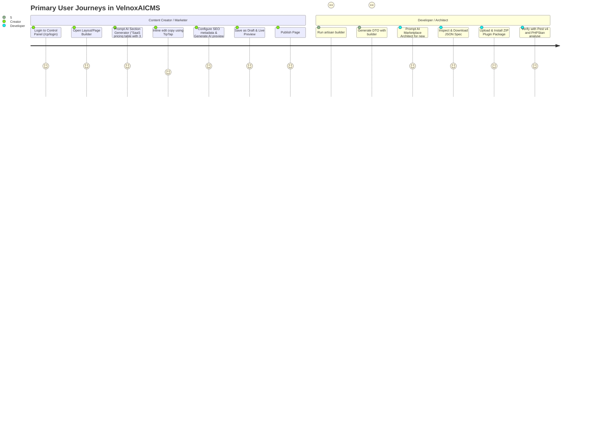

# Product Requirement Document (PRD)
## Project: VelnoxAICMS
**Document Version:** 1.0.0  
**Status:** Approved  
**Product Owner:** VelnoxAICMS Product Team  
**Engineering Leads:** Full-Stack & AI Architecture  

---

## 1. Product Overview & Core Value Proposition

**VelnoxAICMS** is an AI-native, modular Content Management System and visual page-building platform. It uniquely unifies:
1. **Interactive Visual Drag-and-Drop Editing:** High-performance, low-latency visual layout construction directly manipulating an Abstract Syntax Tree (AST) of UI components.
2. **Autonomous Multi-Agent AI Suite:** Deeply embedded agents providing section generation, content synthesis, SEO meta optimization, and automated plugin generation.
3. **Decoupled Modular Architecture:** 23 encapsulated domain modules communicating through Action classes and Spatie Data DTOs.
4. **VILT Enterprise Stack:** Laravel 13, Vue 3.5, Inertia.js v2, Tailwind CSS v4, Nuxt UI v3, Laravel Octane (FrankenPHP), Reverb WebSockets, and Horizon queues.

---

## 2. User Personas & User Journeys

### 2.1 Persona Specifications

#### Persona A: "Elena" — Senior Growth Marketer & Content Lead
- **Goals:** Rapidly deploy conversion-focused landing pages, localize content into 4 languages, optimize organic search rankings without developer intervention.
- **Key Workflows:** Visual Canvas dragging, AI prompt-driven section creation, inline rich text editing, versioning (Draft/Publish), SEO audits.

#### Persona B: "Marcus" — Lead Full-Stack Laravel/Vue Engineer
- **Goals:** Extend the CMS with custom company-specific modules, enforce code standards, ensure sub-10ms TTFB on high-traffic days, expose REST/Sanctum APIs for mobile clients.
- **Key Workflows:** CLI generators (`php artisan builder:make`), DTO type synchronization, custom workflow webhook orchestration, Octane optimization.

#### Persona C: "Devon" — Digital Agency Technical Director
- **Goals:** White-label CMS delivery for 20+ clients, manage strict role permissions, audit team actions, install reusable plugin extensions via marketplace packages.
- **Key Workflows:** RBAC role configuration, ActivityLog inspection, ZIP package module installation, multi-provider AI config.

---

## 3. Detailed Product Feature Breakdown

```mermaid
graph TD
    CMS[VelnoxAICMS Core Engine]
    
    CMS --> VB[Visual Page Builder]
    CMS --> AI[AI Multi-Agent Suite]
    CMS --> WF[Workflow & Automation]
    CMS --> MOD[23 Domain Modules]
    CMS --> SEC[Governance & Security]

    VB --> VB1[Pragmatic DnD Canvas]
    VB --> VB2[Element Hierarchy Tree]
    VB --> VB3[Responsive Viewport Switcher]
    VB --> VB4[CodeMirror Custom CSS]
    VB --> VB5[TipTap Inline Editor]

    AI --> AI1[PageSectionGenerator AST]
    AI --> AI2[ContentGenerator]
    AI --> AI3[SeoOptimizer]
    AI --> AI4[MarketplaceGenerator Spec]

    WF --> WF1[Visual Node Graph]
    WF --> WF2[Inbound/Outbound Webhooks]
    WF --> WF3[Event Trigger Lifecycle]

    MOD --> MOD1[Content, Page, Category]
    MOD --> MOD2[Media Library & Chunked Upload]
    MOD --> MOD3[Layout & Hierarchical Menu]
    MOD --> MOD4[Forms & Testimonials]

    SEC --> SEC1[Spatie RBAC Permissions]
    SEC --> SEC2[Spatie Activity AuditLog]
    SEC --> SEC3[Sanctum Headless API Tokens]
```

### 3.1 Visual Drag-and-Drop Page Builder
- **Canvas Engine:** Utilizes `@atlaskit/pragmatic-drag-and-drop` for smooth 60fps drag operations across container blocks, grids, flexboxes, and nested components.
- **Element Tree (Outliner):** Hierarchical tree view displaying the active DOM structure, allowing instant re-parenting, dragging, renaming, and element deletion.
- **Settings & Style Inspector:** Context-sensitive right sidebar rendering flat CSS properties (camelCase: `backgroundColor`, `padding`, `borderRadius`, `gap`, `fontSize`, `color`, etc.) and component attributes.
- **Multi-Device Breakpoint Previews:** Instant switching between **Desktop (100% / 1280px+)**, **Tablet (768px)**, and **Mobile (375px)** viewports with responsive style cascading.
- **Live CodeMirror CSS Injector:** Real-time scoped custom CSS editor per element and per page.
- **TipTap Inline Editor:** Full rich-text WYSIWYG capabilities for headings, paragraphs, blockquotes, bold/italic, lists, and hyperlinks.
- **Draft & Versioning Lifecycle:**
  - `Save as Draft`: Saves AST state without exposing changes to live frontend visitors.
  - `Save & Publish`: Atomic publish to production with cache invalidation.
  - `Preview Mode`: Renders draft page in isolated sandbox iframe.

### 3.2 AI Multi-Agent Copilot Suite
- **AI Section Generator (`PageSectionGenerator`):**
  - Converts natural language descriptions (e.g. *"Create a modern hero section with a gradient background, headline, subheadline, dual CTA buttons, and customer logos"*) into validated `TElement` AST JSON.
  - Enforces schema constraints: `type`, `name`, `isLayoutElement`, `canDrop`, `children`, and `props.content.innerText`.
  - Protected by `PromptInjectionGuard` and `PIIRedactor`.
- **AI Copywriting Assistant (`ContentGenerator`):**
  - Generates, refines, shortens, expands, translates, or shifts tone for any selected text block.
- **AI SEO Meta Engine (`SeoOptimizer`):**
  - Analyzes page AST content to generate optimal SEO Page Titles (max 60 chars), Meta Descriptions (max 155 chars), OpenGraph titles/descriptions, and targeted focus keyword density scores.
- **AI Extension Architect (`MarketplaceGenerator`):**
  - Generates comprehensive plugin specifications (metadata, migrations, routes, permissions, DTOs, controllers, frontend views) in standard JSON format ready for ZIP compilation.

### 3.3 Media Management & Asset Pipeline
- **Chunked File Uploads:** Client-side 1MB file slice uploading to prevent server timeouts and handle large assets seamlessly.
- **Asset Formats:** Support for JPG, PNG, GIF, WebP, SVG, and modern media assets.
- **Spatie MediaLibrary Integration:** Automatic generation of responsive image srcset, thumbnails, and optimized conversions.

### 3.4 Visual Automation & Workflow Engine
- **Interactive Node Canvas:** Connect triggers (e.g., `FormSubmitted`, `PagePublished`, `UserRegistered`, `InboundWebhookReceived`) to actions (e.g., `SendEmail`, `EmitWebhook`, `GenerateAiContent`, `LogActivity`).
- **Webhook Gateway:** Full verification, signature hashing (HMAC-SHA256), payload transformation, and retry queueing for inbound/outbound webhooks.

### 3.5 Headless API & Token Management
- **Sanctum API Tokens:** Granular token generation with token abilities (e.g., `content:read`, `content:write`, `media:upload`).
- **RESTful Endpoints:** Standardized JSON API responses for headless consuming applications (mobile apps, external web frontends, IoT displays).

---

## 4. User Experience & Design Guidelines

1. **Aesthetics & Theme:**
   - Designed using **Nuxt UI v3** components with customized **Tailwind CSS v4** styling.
   - Comprehensive **Dark Mode & Light Mode** support across all admin screens, canvas menus, and modal dialogs.
   - Micro-animations and transitions using smooth easing curves (`cubic-bezier(0.4, 0, 0.2, 1)`).
2. **Typography & Spatial Consistency:**
   - Typography powered by modern sans-serif fonts with strict vertical rhythm.
   - Consistent 4px/8px spatial grid for all margins, padding, and UI component spacing.
3. **Accessibility (WCAG 2.1 AA):**
   - High color contrast ratios (minimum 4.5:1 for standard text, 3:1 for large headings).
   - Full keyboard navigation support across builder controls, modal popups, and dropdown menus.
   - Semantic ARIA attributes on all interactive canvas elements.

---

## 5. Release Roadmap & Milestones

| Milestone / Version | Scope & Deliverables | Timeline |
|---|---|---|
| **v1.0 (Current Release)** | Core VILT Stack, 23 Modular Domains, Pragmatic DnD Builder, Multi-provider AI Agents (`PageSectionGenerator`, `ContentGenerator`, `SeoOptimizer`, `MarketplaceGenerator`), Chunked Media, Spatie Permissions/Activitylog, Octane FrankenPHP + Reverb + Horizon. | **Q3 2026** |
| **v1.1 (Agentic Copilot & Collaboration)** | Multi-user live collaborative canvas editing (presence cursors over Reverb), AI layout diffing & auto-repair, custom block blueprint sharing. | **Q4 2026** |
| **v1.2 (Headless GraphQL & Edge Delivery)** | Native GraphQL schema generation, Edge caching headers, static site export (SSG) to S3/Cloudflare R2. | **Q1 2027** |
| **v2.0 (Autonomous Web CMS)** | Full-page AI autonomous generation, automated A/B layout testing with AI metric-driven self-optimization, multi-tenant SaaS workspace federation. | **Q2 2027** |

---

## 6. Non-Functional Product Requirements

- **Performance SLO:** Initial Control Panel page load < 400ms (P95); Canvas drag-and-drop latency < 16ms (60 FPS); AI Section Generation response < 3.5s.
- **Reliability:** 99.9% uptime for core content rendering API endpoints; zero unhandled PHP exceptions in production.
- **Scalability:** Capable of serving 50,000 concurrent page requests per standard 4-vCPU server running Laravel Octane (FrankenPHP).
- **Internationalization (i18n):** Complete multi-language UI support in admin panel and multi-locale content support via Spatie Translatable.

---

## 7. Acceptance Criteria & Definition of Done

1. All 23 modules must be fully functional with zero circular dependencies.
2. The Visual Drag-and-Drop builder must produce valid, fully-typed AST JSON adhering strictly to `TElement`.
3. AI Generation Agents must pass `PromptInjectionGuard` and `PIIRedactor` interceptor checks.
4. Pest v4 test suite must execute with 100% passing rate (`composer test`).
5. PHPStan static analysis must pass at strict level (`composer phpstan`).
6. Codebase must pass Laravel Pint formatting (`vendor/bin/pint --dirty`).
