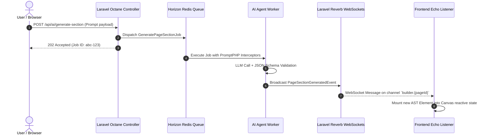

# Technical Requirement Document (TRD)
## Project: VelnoxAICMS
**Document Version:** 1.0.0  
**Status:** Approved  
**Lead Systems Architect:** Enterprise Architecture Team  
**Runtime Environment:** PHP 8.5+ / Laravel 13 / Octane FrankenPHP / Node 20+  

---

## 1. System Architecture & Topology

VelnoxAICMS is built on a high-throughput **VILT (Vue 3 + Inertia.js + Laravel + Tailwind CSS)** architecture augmented with long-running worker processes via **Laravel Octane (FrankenPHP)**, asynchronous queue management via **Laravel Horizon (Redis)**, and real-time bidirectional WebSocket communication via **Laravel Reverb**.

```mermaid
graph TB
    subgraph Client Tier
        Browser[Client Web Browser / Mobile Browser]
        HeadlessConsumer[Headless API Clients / Mobile Apps]
    end

    subgraph Edge & Web Server Tier
        FrankenPHP[FrankenPHP Caddy Web Server / Octane Engine]
        ReverbServer[Laravel Reverb WebSocket Server :8081]
    end

    subgraph Application Core Tier (Laravel 13 + Octane)
        Router[Inertia / REST Route Dispatcher]
        InertiaCore[Inertia.js v2 SSR / Page Renderer]
        ModulesEngine[nwidart/laravel-modules: 23 Domain Modules]
        ActionLayer[Domain Action Pattern Layer]
        DTOLayer[Spatie Laravel Data DTO Layer]
        AIAgents[AI Agent Layer: Laravel AI + PromptPHP Interceptors]
    end

    subgraph Asynchronous & Queue Tier
        Horizon[Laravel Horizon Queue Supervisor]
        RedisQueue[(Redis Queue Store :6379)]
        Workers[FrankenPHP Octane Worker Threads]
    end

    subgraph Data & Storage Tier
        PrimaryDB[(Primary DB: MySQL 8+ / PostgreSQL 14+ / SQLite)]
        MediaStorage[Spatie MediaLibrary / Local / S3 Bucket]
        RedisCache[(Redis Cache & Session Store)]
    end

    Browser <-->|HTTP/3 & HTTPS| FrankenPHP
    Browser <-->|WSS WebSockets| ReverbServer
    HeadlessConsumer <-->|REST API / Sanctum| FrankenPHP

    FrankenPHP --> Router
    Router --> InertiaCore
    Router --> ModulesEngine
    ModulesEngine --> ActionLayer
    ActionLayer --> DTOLayer
    ActionLayer --> AIAgents
    ActionLayer --> PrimaryDB

    ActionLayer -->|Dispatch Async Jobs| RedisQueue
    RedisQueue --> Horizon
    Horizon --> Workers
    Workers --> AIAgents
    Workers --> MediaStorage
    Workers --> ReverbServer

    ActionLayer --> RedisCache
    ActionLayer --> MediaStorage
```

---

## 2. Technology Stack & Component Specifications

| Layer / Subsystem | Technology Component | Version | Role & Technical Responsibility |
|---|---|---|---|
| **Backend Core** | PHP | `8.5+` | Primary execution runtime, leveraging strict types, constructor property promotion, enums, match expressions, and fiber-based concurrency. |
| **Framework** | Laravel Framework | `v13.x` | Modern streamlined application structure, middleware pipeline in `bootstrap/app.php`, native eager loading limits, and routing. |
| **High-Performance Server** | Laravel Octane + FrankenPHP | `v2.x` | Long-running in-memory worker process manager eliminating PHP bootstrap overhead; sub-millisecond execution. |
| **Queue Management** | Laravel Horizon | `v5.x` | Redis queue monitoring, auto-scaling worker groups, job lifecycle tracking, and retry policies. |
| **Real-time WebSockets** | Laravel Reverb + Laravel Echo | `v1.x / v2.x` | Pure PHP WebSocket server handling live updates, builder presence, and event broadcasting. |
| **SPA Glue / Bridge** | Inertia.js Laravel & Vue | `v3.x / v2.x` | Client-side SPA routing with server-side controllers; custom module view resolution (`MyModule::index`). |
| **Frontend Framework** | Vue.js | `v3.5.x` | Declarative UI reactivity, Composition API (`<script setup lang="ts">`), and single-root component hierarchy. |
| **UI Components & CSS** | Nuxt UI v3 + Tailwind CSS | `v3.x / v4.x` | Accessible headless component primitives, modern theme tokens, dark/light mode toggles, and utility classes. |
| **Drag & Drop Engine** | `@atlaskit/pragmatic-drag-and-drop` | Latest | 60 FPS accessible, performant drag and drop for builder canvas elements and tree outliner. |
| **Rich Text Editor** | TipTap Core & Extensions | `v2.x` | Headless, extensible WYSIWYG rich text editing for builder typography elements. |
| **Code Editor** | CodeMirror | `v6.x` | Embedded syntax-highlighted CSS code editor for custom element and page styling. |
| **Type Synchronization** | Spatie TypeScript Transformer | `v3.x` | Compiles PHP Data Transfer Objects (`Spatie\LaravelData\Data`) directly into frontend `auto-imports.d.ts` TypeScript definitions. |
| **Modular Core** | `nwidart/laravel-modules` | Latest | Encapsulates 23 domain modules with isolated migrations, routes, models, views, DTOs, and actions. |
| **AI Integration** | `laravel/ai` + `PromptPHP` | `v0.x` | Multi-LLM provider abstraction with interceptor pipeline (`PromptInjectionGuard`, `PIIRedactor`). |
| **Security & Auditing** | Spatie Permissions & Activitylog | Latest | Role-based permission policies and polymorphic activity audit trails. |

---

## 3. Modular Engine & Code Architecture

### 3.1 Module Directory Hierarchy (`Modules/{ModuleName}`)
Every module follows a strictly uniform structure:
```
Modules/
└── {ModuleName}/
    ├── app/
    │   ├── Actions/            # Reusable business logic & DB transactions
    │   ├── Agents/             # Laravel AI Agent classes & JSON schema definitions
    │   ├── Data/               # Spatie Laravel Data DTOs with #[TypeScript] attribute
    │   ├── Events/             # Broadcast & domain events
    │   ├── Http/
    │   │   ├── Controllers/    # Thin controllers delegating to Actions & rendering Inertia views
    │   │   └── Requests/       # Form request validation classes
    │   ├── Jobs/               # Asynchronous queue jobs handled by Horizon
    │   ├── Models/             # Eloquent models with typed casts and relationships
    │   └── Providers/          # Module service provider & route binding
    ├── config/                 # Module configuration files
    ├── database/
    │   ├── factories/          # Pest/PHPUnit model factories
    │   ├── migrations/         # Isolated module database migrations
    │   └── seeders/            # Module database seeders
    ├── resources/
    │   └── views/              # Inertia Vue page components (e.g. index.vue, create.vue)
    ├── routes/
    │   ├── api.php             # Headless REST API routes
    │   └── web.php             # Web & Control Panel routes
    ├── tests/                  # Pest v4 feature and unit test suite
    └── module.json             # Module metadata, dependencies, and priority
```

### 3.2 Action Pattern & Thin Controllers
Controllers MUST NOT contain business queries or mutation logic. All operations are encapsulated inside single-responsibility Action classes:

```php
namespace Modules\Page\Http\Controllers;

use Inertia\Inertia;
use Inertia\Response;
use Modules\Page\Actions\GetAllPagesAction;
use Modules\Page\Data\PageData;
use App\Http\Controllers\Controller;

class PageController extends Controller
{
    public function index(GetAllPagesAction $action): Response
    {
        $pages = $action->handle();

        return Inertia::render('Page::index', [
            'pages' => PageData::collect($pages),
        ]);
    }
}
```

### 3.3 End-to-End Type Safety: PHP DTO to TypeScript
All payloads sent to Vue views or returned via APIs use **Spatie Laravel Data** classes decorated with `#[TypeScript]`:

```php
namespace Modules\Page\Data;

use Spatie\LaravelData\Data;
use Spatie\LaravelData\Optional;
use Spatie\TypeScriptTransformer\Attributes\TypeScript;
use Modules\Page\Models\Page;

#[TypeScript]
class PageData extends Data
{
    public function __construct(
        public string $id,
        public string|Optional $type,
        public string $slug,
        public string $title,
        public ?string $content = null,
        public ?string $status = 'draft'
    ) {}

    public static function fromModel(Page $page): self
    {
        return new self(
            id: (string) $page->id,
            type: 'page',
            slug: $page->slug,
            title: $page->title,
            content: $page->content,
            status: $page->status
        );
    }
}
```

Automated synchronization is triggered via:
```bash
php artisan typescript:transform
```
Which generates TypeScript interfaces in `types/generated.d.ts` consumed directly by Vue components:
```vue
<script setup lang="ts">
defineProps<{
    pages: App.Modules.Page.Data.PageData[]
}>()
</script>
```

---

## 4. Visual Page Builder Engine Architecture

### 4.1 Abstract Syntax Tree (AST) & Component Schema
The canvas is backed by a tree of `TElement` objects stored in a serialized JSON column (`content` on `pages`, `posts`, and `layouts` tables).

```typescript
export interface TElement {
    id?: string;
    type: 'wrapper' | 'grid' | 'flexbox' | 'paragraph' | 'heading' | 'link' | 'image' | 'video' | string;
    name: string;
    isLayoutElement: boolean;
    canDrop: boolean;
    children: TElement[];
    props: {
        tag?: string;
        content?: {
            innerText?: string;
            html?: string;
        };
        // Flat camelCase CSS styling attributes
        backgroundColor?: string;
        color?: string;
        padding?: string;
        paddingTop?: string;
        paddingBottom?: string;
        margin?: string;
        fontSize?: string;
        textAlign?: 'left' | 'center' | 'right' | 'justify';
        borderRadius?: string;
        display?: string;
        gridTemplateColumns?: string;
        gap?: string;
        [key: string]: any;
    };
}
```

### 4.2 Draggable Component Triad Architecture
Every builder component consists of four decoupled files:
1. `config.ts`: Defines element metadata, default props, icons, and category.
2. `settings.ts`: Defines the schema of the right sidebar settings form rendered when the element is active.
3. `[ComponentName].vue`: Canvas edit-mode component with Pragmatic DnD drop zones and selection outline markers.
4. `render.vue`: Zero-overhead frontend production component stripped of all edit markers for clean SSR/SPA rendering.

---

## 5. Asynchronous Processing & Real-Time WebSockets



### 5.1 Real-Time WebSocket Channel Mapping
- `private-builder.{pageId}`: Transmits canvas locks, live collaborative cursor positions, and background AI generation completion events.
- `private-workflow.{workflowId}`: Transmits live node execution telemetry during manual or automated workflow runs.
- `private-user.{userId}`: Transmits system notifications, media conversion completions, and export package download links.

---

## 6. Security, Authentication & Access Control

1. **Authentication:** Session-based Inertia authentication for Control Panel users; stateless Bearer token authentication via **Laravel Sanctum** for API clients.
2. **Authorization & RBAC:** Powered by **Spatie Laravel Permission**. Roles (e.g. `Super Admin`, `Editor`, `Author`) map to explicit permissions (e.g. `page.create`, `page.publish`, `ai.generate`, `marketplace.install`).
3. **Audit Logging:** Integrated with **Spatie Activitylog**. Automatically tracks polymorphic `subject_type`, `subject_id`, `causer_id`, `attribute_changes` (`attributes` vs `old`), and IP metadata.
4. **AI Interceptor Guardrails:**
   - `PromptInjectionGuard`: Evaluates input prompts against known jailbreak/override vectors, blocking execution before reaching model APIs.
   - `PIIRedactor`: Automatically redacts credit cards, private API keys, and bearer tokens before payload dispatch.

---

## 7. Testing, Static Analysis & DevOps Pipeline

- **Test Suite:** Pest v4 (`php artisan test --compact` / `composer test`).
- **Static Analysis:** PHPStan Level 8+ with Larastan (`composer phpstan`).
- **Code Refactoring:** Rector (`composer rector`).
- **Code Formatter:** Laravel Pint (`vendor/bin/pint --dirty`).
- **Local Dev Orchestrator:** Concurrent multi-service development launcher:
  ```bash
  composer run dev
  ```
  Booting FrankenPHP Octane, Horizon, Reverb WebSockets, Pail logs, and Vite HMR simultaneously.
